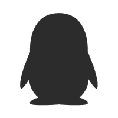

## 欢迎光临 OOM-WG 的基地

### 取得于开发团队的联系

 

OOM-WG 由 @TianwanTW 发起，是一个致力于用编程创造美好回忆的组织。 
OOM 的缩写灵感源自 out of memory（内存溢出），而我们更希望 out of memories（回忆溢出）。 
组织成员精通多种编程语言，如 C、C++、C#、Dart、Go、Kotlin 等，汇聚多元技术，共同成长。

---
